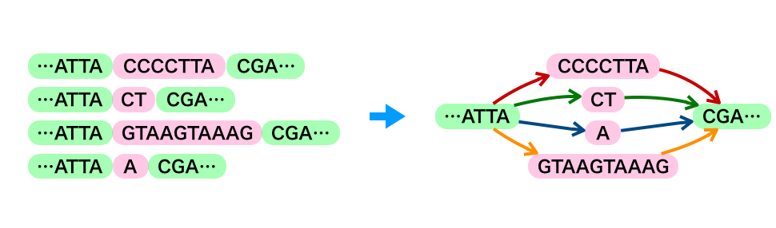
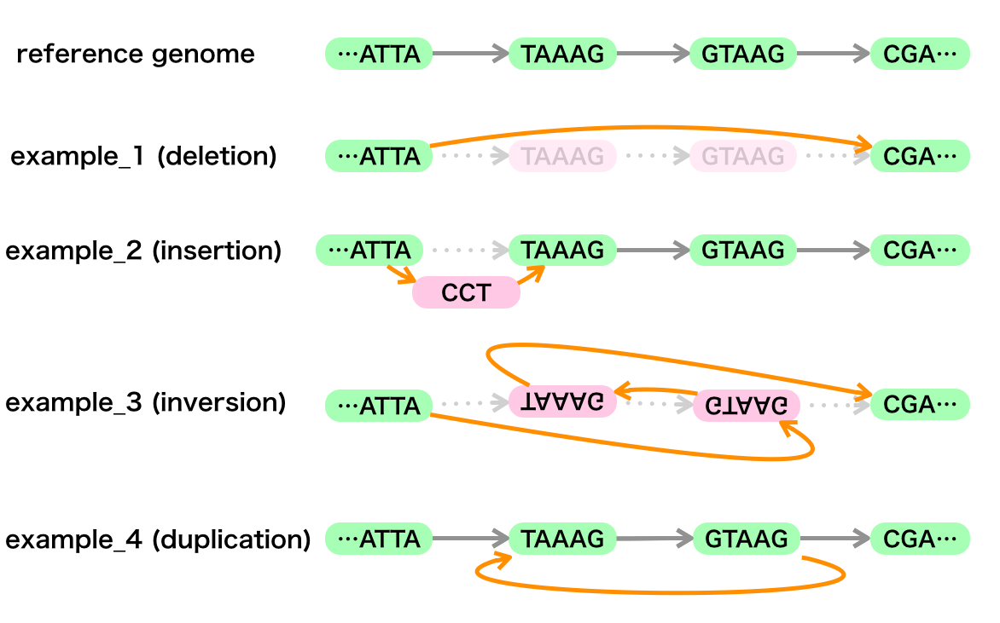

※ [http://genomegraph.jp/](http://genomegraph.jp/) よりご覧ください。

# What's new

第１回 Genome Graph 研究会と第２回 Genome Graph 研究会のページを追加しました。

* [第１回](meeting001.md)
* [第２回](meeting002.md)

# Genome Graph Japan

日本国内でゲノムグラフの開発・利用を推進する研究会を立ち上げました(2017/11/9)。

## Genome Graph 研究会

[GitHub レポジトリ](https://github.com/genomegraph/)

### 趣旨

従来ヒトゲノム解析に用いられてきたリファレンス配列に対して、そのバイアスや情報のロスを緩和し、集団の多型情報を表現するため、情報科学的なグラフ構造をリファレンス配列に導入したリファレンスゲノムグラフという概念が注目を集めています。
こうしたゲノムのグラフ表現はヒトリファレンスゲノムのみならず、ゲノムアセンブリやメタゲノム、比較ゲノムなど様々な分野で応用が期待され、ゲノム情報・ゲノムデータベースを扱っている研究機関・研究者にとって今後重要になってくると考えられます。

そこでこのたび、広くゲノムグラフに対する理解を深め、議論をする場を設けたいと考え、ゲノムグラフ研究会を発足しました。

### グラフゲノムとは

ゲノムの情報を従来の線形な表現ではなく、数学的なグラフ理論に基づいて表現し、解析を行う概念のことです。
アセンブリやSV検出、メタゲノム解析などで応用できると期待されています。

構造多型（SV）は以下のようにグラフで表現できます。

### 参考資料

#### vg勉強会資料

[BioHackathon17.11](http://wiki.lifesciencedb.jp/mw/BH17.11)@熊本にてvg勉強会を開きました。
vgハンズオン資料は[こちら](https://github.com/genomegraph/workshop)にあるvg_tutorial内のvg_tutorial.mdをご覧ください。

#### 可視化ツール: MoMIG

[MoMIG](https://github.com/MoMI-G/MoMI-G)

#### ゲノムグラフブラウザハンズオン資料

ゲノムグラフブラウザハンズオン資料は[こちら](https://github.com/genomegraph/workshop/blob/master/browser_tutorial/browser_tutorial.md)をご覧ください。

#### vg日本語版ドキュメント

東大新領域の犀川さんがまとめてくれています。[こちら](usage)からご覧ください。

#### vgチートシート

DBCLSの片山が作成しています。[こちら](https://github.com/genomegraph/vg-cheatsheet)からご覧ください。

### 今後の予定

当面は [SPARQLthon](http://wiki.lifesciencedb.jp/mw/SPARQLthon) で打ち合わせなどを行っていきます。
研究会や講習会などが決まればこちらにリンクします。

* 2018/2/27 [第１回 Genome Graph 研究会](meeting001.md)
* 2018/3/5-9 [ポルトガル](portugal)
* 2018/3/26 [第２回 Genome Graph 研究会](meeting002.md)

### 参加するには

広くゲノム・グラフの開発や利用に興味のある方のご参加をお待ちしています。
既存メンバーにご連絡頂くか、ぜひ上記 SPARQLthon や研究会にお越し下さい。
研究会の運営にご協力頂ける方は下記メンバー表に追記してプルリクを下さいませ。

* [参加メンバー](members)

