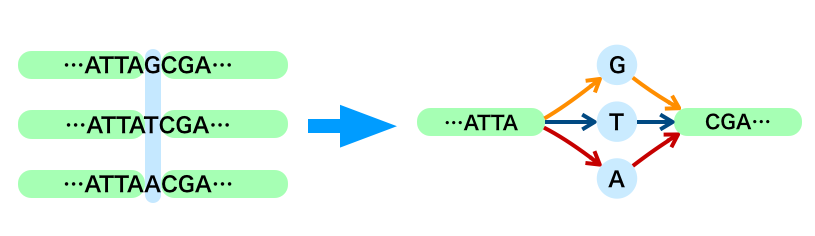

# Genome Graph Japan

日本国内でゲノムグラフの開発・利用を推進する研究会を立ち上げました(2017/11/9)。

## Genome Graph 研究会

[GitHub レポジトリ](https://github.com/genomegraph/)

### グラフゲノムとは

ゲノムの情報を従来の線形な表現ではなく、数学的なグラフ理論に基づいて表現し、解析を行う概念のことです。
アセンブリやSV検出、メタゲノム解析などで応用できると期待されています。

構造多型（SV）は以下のようにグラフで表現できます。

### vg勉強会資料

BioHackathon17.11@熊本にてvg勉強会を開きました。
vg勉強会資料は[こちら](https://github.com/genomegraph/workshop)にあるvg_tutorial内のvg_tutorial.mdをご覧ください。

### vgの資料

東大新領域の犀川さんがまとめてくれています。
[こちら](usage)からご覧ください。

### 今後の予定

当面は [SPARQLthon](http://wiki.lifesciencedb.jp/mw/SPARQLthon) で打ち合わせなどを行っていきます。
研究会や講習会などが決まればこちらにリンクします。

* 2018/3/5-9 [ポルトガル](portugal)

### メンバー

興味のある方のご参加をお待ちしています。

* [参加メンバー](members)

